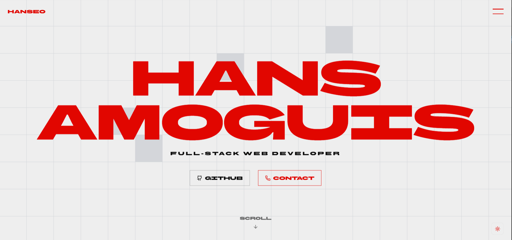

# Hans Amoguis — Full-Stack Developer

I design and build maintainable, UX-focused web systems with a strong emphasis on architecture, performance, and interaction design.

🔗 **Live Site:** https://hanseo.tech  
💼 **LinkedIn:** https://linkedin.com/in/hanseooo  
🐙 **GitHub:** https://github.com/Hanseooo

---

## What This Portfolio Showcases

- Horizontal scroll storytelling built with GSAP ScrollTrigger
- Gesture-based navigation (drag + scroll hybrid)
- Desktop-first interaction patterns with mobile-safe fallbacks
- Clean separation between animation logic and UI structure
- UX-driven decisions for performance, clarity, and accessibility

---

## Tech Stack

### Frontend
- React + TypeScript
- GSAP (ScrollTrigger)
- Framer Motion
- Tailwind CSS
- shadcn/ui

### Architecture & UX
- Component-driven design
- Runtime environment detection (desktop, mobile, in-app browsers)
- Progressive enhancement for complex interactions

---

## Key Design & Engineering Decisions

- Desktop and Mobile uses pinned horizontal scrolling for narrative flow
- Mobile in Webview browsers avoid scroll hijacking in favor of native vertical behavior
- Optional Drag Gesture for Desktop for horizontal scroll
- Animations are selectively disabled in WebViews for stability
- ScrollTrigger instances are scoped and reverted to avoid side effects

---

## Running Locally

```bash
pnpm install
pnpm dev
```

## Live Activity Environment Variables

If you plan to enable the Live Activity section, copy `.env.example` to `.env.local` and set the values.

Required:

- `GITHUB_TOKEN`
- `GITHUB_USERNAME`
- `SPOTIFY_CLIENT_ID`
- `SPOTIFY_CLIENT_SECRET`
- `SPOTIFY_REFRESH_TOKEN`
- `DISCORD_USER_ID`

Optional tuning:

- `ACTIVITY_GITHUB_REVALIDATE_SECONDS`
- `ACTIVITY_SPOTIFY_REVALIDATE_SECONDS`
- `ACTIVITY_DISCORD_REVALIDATE_SECONDS`
